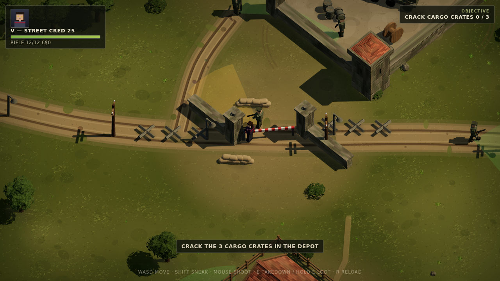
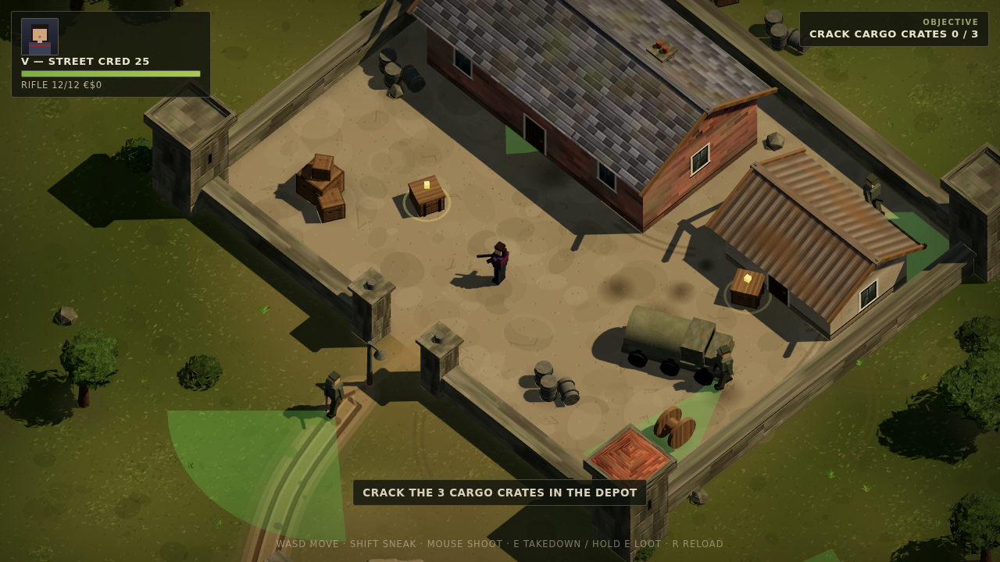

# NIGHT CITY: COMMANDOS (v3)

A Commandos-style stealth mission set in Night City's outskirts — **rebuilt on a
real engine**: three.js (vendored r160), a true real-time 3D scene under an
orthographic tactical camera. Real sunlight with soft shadow maps, painted +
bump-mapped canvas textures on every surface, hand-composed map. Zero code is
shared with v1/v2 — the only link is the shared record: it **reads**
`localStorage` key `ncpx2077_v1` (V's gender, street cred, arsenal, Kiroshi
optics become mission perks) and on a successful extraction **writes back**
eddies and kills with a read-modify-write that leaves the v1/v2 save schema
untouched.




## The mission — OPERATION DEAD MAIL

Barghest runs stolen cargo through a walled freight depot on the old coast road.
Crack the 3 cargo crates, then reach the SW extraction. A checkpoint with a boom
barrier and tank traps guards the road; watchtowers anchor the depot walls;
patrols sweep the yard; the farmstead porch has eyes.

- **WASD** move · **SHIFT** sneak (quieter, harder to spot)
- **Mouse** aim/shoot (loud — everyone within earshot comes running)
- **E** silent takedown from behind · hold **E** to crack crates
- **R** reload
- Guard view cones are drawn on the ground, **clipped by real line-of-sight**
  (walls and buildings cut them — classic Commandos). Amber = suspicion,
  red = iron out. Two alerted guards raise the alarm and reinforcements arrive.
  Kiroshi optics on your record reveal calm (green) cones too.

## Tech

- **three.js 0.160** vendored at `vendor/three.module.js`, ES modules via
  importmap, no bundler, no network deps.
- `main.js` — renderer (ACES, PCFSoft 4096 shadows), 45°/52° ortho rig that
  follows the plan-space camera, ground-plane mouse picking.
- `tex.js` — every material is a painted canvas + derived bump map: grass,
  dirt, ashlar stone, brick, stucco, roof tiles, slate, planks, corrugated
  iron, bark, tarp, sand, stencilled crates.
- `world.js` — the whole set: 4096² painted terrain (roads with ruts, ploughed
  field, packed yards, blade clumps) + gabled buildings baked per-facade
  (windows, doors, ivy, signs), depot walls with watchtowers, wood fences,
  telegraph poles, truck, wagon, sandbags, tank traps, boom barrier, lobed
  trees, tufts, contact-AO blobs.
- `map.js` + `sim.js` + `state.js` + `record.js` — **pure plan-space modules**
  (no THREE, no DOM): hand-authored map + collision/LOS/raycasts, and the
  stealth sim (patrols → suspicion → alert → alarm → reinforcements, takedowns,
  looting, extraction). The node smoke test drives a full mission through them.
- `actors.js` — articulated low-poly humanoids, procedural walk, low-ready vs
  aim poses, rifle/pistol variants.
- `fx.js` — LOS-clipped cone fans, tracers, muzzle light, blood decals painted
  permanently into the terrain canvas, objective crates, extraction ring.
- `hud.js` — DOM overlay: operative plate (painted portrait), objective,
  alarm, toasts, crate progress, extraction arrow, dossier briefing, debrief
  (which banks the haul into the shared record).

## Test & run

```bash
node test/smoke.js    # headless full mission: perks, vision, takedown, alarm,
                      # loot, extraction, record write-back (schema-safe), death
./run.sh              # serve on http://0.0.0.0:35464
node test/shot.js 'http://127.0.0.1:35464/?play&at=gate' out.png   # headless WebGL screenshot
```

Debug URLs: `?play` skips the briefing · `?at=depot|gate|checkpoint|farm|insert`
teleports · `?zoom=2` closer camera · `?rec=demo` seeds a demo record
(only if none exists).
